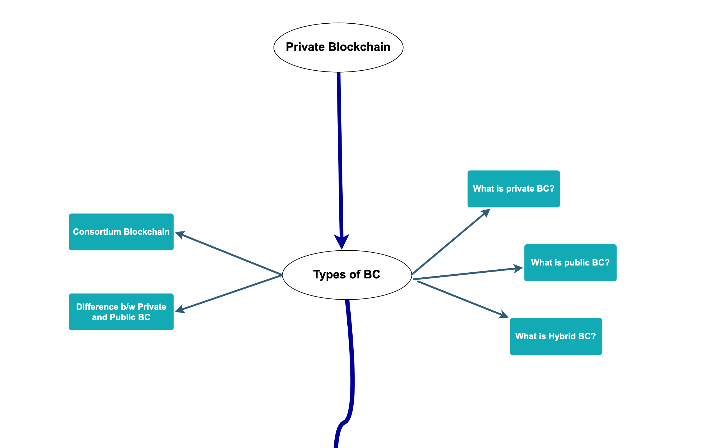

# Private Blockchain

Private blockchain is developed and maintained by a private organization who has the authority over the mining process and consensus algorithm. The private organization decides who can join the network and have the access download the nodes.

Is it sound no more decentralized now!. No, No one can read, write or audit the blockchain anytime. Moreover, the governing organization can override the blockchain command or delete whenever they please!

Rather than calling it a public ledger, you should call it a `distributed ledger` which is shared with its all chosen users.

Yes, the ledger is still cryptographically secured and no one can keep an eye on your money. So, the basic purpose is still the same.

One of the private blockchain examples is Hyperledger. There are few more but not very famous and in more use, so we will mainly focus over Hyperledger project that is started by Linux foundation and backed by major giants like IBM, Intel, Samsung, Microsoft, Visa, American Express and blockchain startups such as Blockforce.

Here is the complete road map that i have uploaded in this dir /files/ as there is not some easy way to embed in readme.md

Glimpse:

 

</a>
 
